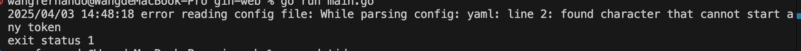

# gin-web

go mod init exchange_app

## 安装依赖
go get -u github.com/gin-gonic/gin
go get github.com/spf13/viper
go get -u gorm.io/gorm
go get -u golang.org/x/crypto/bcrypt
go get github.com/golang-jwt/jwt/v5

## yml格式

出现这个错误是因为yml格式错误
> 检查点:
要保证 config.yml 文件里的所有缩进都使用空格，并且同一层级的缩进空格数一致，一般为 2 个或 4 个空格。
检查文件编码是否为 UTF-8，避免出现不可见的非法字符

## gin
默认跑在8080